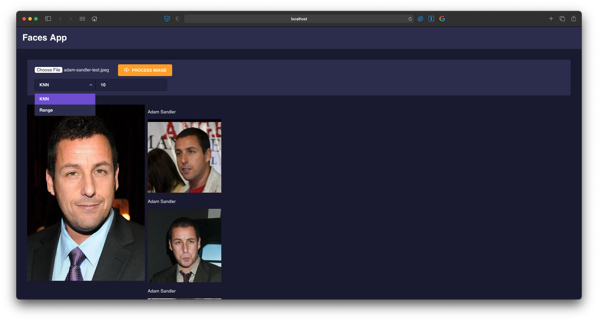

# Base de Datos 2 - Proyecto 3
### Integrantes
- Massimo Imparato Conetta
- Miguel Angel Alvarado
- David Soto Aguirre

## Índice
  - [Introducción](#introducción)
  - [Implementación](#implementación)
    - [Construcción del índice Rtree](#construcción-del-índice-rtree)
    - [Algoritmo de búsqueda KNN](#algoritmo-de-búsqueda-knn)
    - [Algoritmo de búsqueda por Rango](#algoritmo-de-búsqueda-por-rango)
    - [Análisis y experimentación](#análisis-y-experimentación)
    - [Aplicación Web](#aplicación-web)


## Introducción
El objetivo de este proyecto fue implementar un servicio web para la identificación automática de personas a partir de una colección grande de imágenes de rostros. 
Está enfocado en la construcción optima de una estructura multidimensional para dar soporte a las búsquedas y recuperación eficiente de imágenes. Para ello hacemos uso de la libreria [Face Recognition](https://github.com/ageitgey/face_recognition). En dicha librería ya se encuentra implementado las técnicas necesarias para obtener de cada imagen una representación numérica y compacta (enconding). Se usará una colección de referencia con más de 13 mil imágenes de rostros de personas, disponible en el [siguiente enlace](http://vis-www.cs.umass.edu/lfw/).


## Implementación
### Construcción del índice Rtree
Para construir el índice Rtree, se usó la librería [Rtree](https://pypi.org/project/Rtree/) de python, que provee los métodos necesarios para que indexemos nuestros vectores característicos.

### Algoritmo de búsqueda KNN
La búsqueda KNN nos retorna los K elementos más cercanos. En ese sentido, utilizamos este tipo de búsqueda para retornar las imágenes que son las K más similares al objeto de consulta.

#### KNN-Rtree
Para el KNN del RTree, claramente, hacemos uso de la función de la misma librería. En primer lugar, leemos nuestro indice Rtree guardado, asignamos los valores necesarios correspondientes y encodeamos la query a procesar. Luego de esto, para cada elemento en la lista del query (ya que es posible que existan varias caras), las agregamos a la variable que le pasaremos a la función de la librería Rtree.
```python
def KNNRtree(k, query, n):
    rtree = 'RtreeIndexFile' + str(n)
    encodedQuery = encode(query)
    prop = index.Property()
    prop.dimension = 128
    prop.buffering_capacity = 10
    rtreeIndex = index.Rtree(rtree, properties=prop)
    queryList = list(encodedQuery)

    for elem in encodedQuery:
        queryList.append(elem)
    return rtreeIndex.nearest(coordinates=queryList, num_results=k, objects='raw')
```

#### KNN-Secuencial
Es importante denotar, para el KNN Secuencial, que está implementado en memoria principal. El procedimiento es el siguiente; similarmente a como se hizo para indexar el RTree, hacemos una especie de indexación de las caras conocidas hasta "n" y llevamos la cuenta de estas. Una vez que hemos llegado a "n", cesaremos con la parte de indexación en memoria y le pasamos esta información en un bucle for a la función de la librería Face Recognition face_distance. Agregaremos las distancias correspondientes a una estructura heap queue, con la cual finalmente retornaremos los K resultados más cercanos a nuestra query. Lo más notorio al realizar la busqueda secuencial de esta manera, es que la gran mayoría del tiempo utilizado es la primera parte, indexar. Calcular, guardar y retornar los resultados resulta mucho más rápido, como se podrá apreciar en la experimentación realizada.
```python
def KNNSequential(k, query, n):
    encodedQuery = encode(query)
    dirList = os.listdir(path)

    count = 0
    names = []
    known = []
    shouldBreak = False

    for filepath in dirList:

      folderPath = path + '/' + filepath
      imageList = os.listdir(folderPath)


      for imageFile in imageList:
        count += 1
        imagePath = folderPath + '/' + imageFile

        #processing this image
        # print(imageFile)

        image = fr.load_image_file(imagePath)
        encodings = fr.face_encodings(image)
        if encodings:
          names.append(imageFile)
          known.append(encodings[0])
        
        if count == n - 1:
          shouldBreak = True
          break
    
      if shouldBreak:
        break

    distancesList = fr.face_distance(known, encodedQuery)
    result = []

    for i in range(len(distancesList)):
        result.append((distancesList[i], names[i]))

    heapq.heapify(result)
    return heapq.nsmallest(k, result)
```

### Algoritmo de búsqueda por Rango
La busqueda por rango nos retorna 0 o más elementos, pues el resultado depende del radio establecido. Similarmente a la función KNN Secuencial, esta función sólo la pudimos implementar en memoria, razón por la cual no pudimos incluírla en el front-end, ya que de ser así, tomaría mucho tiempo al "indexar" previo a calcular los resultados. Al momento de realizarla no consideramos que no funcionaría de esta manera. Sin embargo, lamentablemente, no contamos con el tiempo necesario para poder modificarla e utilizarla para la búsqueda en el front-end.

```python
def rangeSearch(k, query):
    encodedQuery = encode(query)
    dirList = os.listdir(path)

    count = 0
    names = []
    known = []

    for filename in dirList:
        count += 1

        print("Processing: ", filename)
        imageFile = path + '/' + filename
        image = fr.load_image_file(imageFile)

        encodings = fr.face_encodings(image)[0]

        names.append(filename)
        known.append(encodings)
    
    distances = fr.face_distance(known, encodedQuery)
    result = []

    for i in range(count):
        result.append((distances[i], names[i]))
    
    heapq.heapify(result)
    return heapq.nsmallest(k, result)
```

### Análisis y experimentación
Para analizar los algoritmos de búsqueda usamos el conjunto de datos variando el tamaño de la colección. Como vemos en el gráfico, el KNN-Rtree es mejor porque lo estamos leyendo en disco, mientras que el KNN-Secuencial está en memoria. Como mencionamos anteriormente, nuestra implementación ya que funciona en memoria, a simple vista, nos retorna resultados más rápido que el RTree, por lo cual decidimos separar las funciones en dos partes para poder así demostrar el tiempo que tarda en la indexación por cada valor de N. El RTree tiene una gran ventaja sobre el secuencial en esta experimentación, es mucho más escalable y aún así cuando el índice se vuelve muy grande, las consultas demoran tiempos bastante parecidos y se puede notar que no hay un patrón claro de que el tiempo esté creciendo junto con el valor de N, por lo contrario, algunos tiempos hasta son menores comparados a valores previos de N.

Tiempo (s) | KNN-Rtree | KNN-Secuencial | KNN-Secuencial (Memoria)
------------ | ------------- | ------------- | -------------
N=100 | 1.03 | 6.77          | 0
N=200 | 0.64 | 12.49         | 0
N=400 | 0.60 | 24.96         | 0
N=800 | 0.78 | 59.88         | 0
N=1600 | 1.06 | 1.53.53      | 0
N=3200 | 1.53 | 3.41.62      | 0.01
N=6400 | 1.02 | 6.50.96      | 0.02
N=12800 | 0.97 | 12.50.58    | 0.03

Valor de K = 8

### Aplicación web
Para visualizar los resultados implementamos una pequeña aplicación web usando [Flask](https://flask.palletsprojects.com/en/2.0.x/#) para el servidor y [Angular](https://angular.io/) para el front. A continuación se muestra la interfaz.


